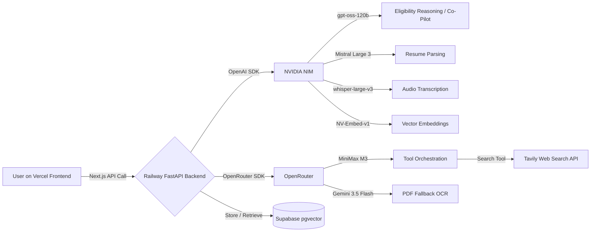

<p align="center">
  
</p>

<h1 align="center">🎯 Opportunity Hunter</h1>

<p align="center">
  <em>"Never miss a life-changing opportunity again."</em>
</p>

<p align="center">
  <a href="#"></a>
  <a href="#"></a>
  <a href="#"></a>
  <a href="#"></a>
  <a href="#"></a>
  <a href="https://github.com/rahulcvwebsitehosting/Opportunity-Hunter"></a>
</p>

---

Opportunity Hunter is an autonomous AI agent that finds scholarships, hackathons, grants, and internships for you. You upload a resume or paste a GitHub link. It builds a profile, searches the web, scores what it finds, and even drafts applications. No more scrolling through pages of deadlines.

---

## 🧠 Development Story & AI Stack

### Built by **GPT-5.6** + **Codex (OpenAI)**

Not gonna bury the lede here. **GPT-5.6 wrote almost everything** — the full backend architecture, all four agent loops (Profiler, Hunter, Reasoner, Co-Pilot), the `llm_router.py` that handles model routing, every FastAPI route (`/onboard`, `/hunt`, `/opportunities`, `/apply`), the frontend in Next.js with Tailwind and Shadcn, even the Supabase schema with pgvector. The split-deployment model (Vercel frontend, Railway backend, Supabase database) was GPT-5.6's design too.

**Codex (OpenAI)** was the other half of this. It handled the iterative loop — debugging sessions, fixing build errors, optimizing slow endpoints, refactoring components that felt off. Accessibility (WCAG AA stuff, focus traps, keyboard nav, `prefers-reduced-motion`) was all Codex. Everytime something broke, Codex traced it, patched it, and the fix went back into the cycle.

I also swapped in other models for specific tasks — **GLM 5.2**, **DeepSeek V4 Pro**, **Mistral Large 3** — to generate and compare different module-level approaches. But the core architecture, the agent logic, the deployment configs? That's GPT-5.6 and Codex.

### Embedded Models (running inside the backend)

These aren't just API calls. They're embedded directly into the agent stack:

| Model | Provider | What it does |
|-------|----------|-------------|
| **gpt-oss-120b** | NVIDIA NIM | Eligibility reasoning, tool orchestration |
| **Mistral Large 3** | NVIDIA NIM | Resume parsing, cover letter drafting |
| **MiniMax M3** | OpenRouter | Agentic tool-calling, web search orchestration |
| **Gemini 3.5 Flash** | Free tier | OCR fallback for scanned PDFs |
| **whisper-large-v3** | NVIDIA NIM | Audio transcription (voice profile input) |
| **NV-Embed-v1** | NVIDIA NIM | Vector embeddings for semantic similarity |

The backend hits each model through OpenAI-compatible SDKs (NVIDIA NIM) or OpenRouter. No middleman orchestration service. `llm_router.py` handles failover, retries, formatting differences.

---

## ✨ Core Features

### 🔍 Resume Parsing (Profiler Agent)
Drop a PDF or paste a GitHub link. Mistral Large 3 extracts your skills, education, experience into a structured vector profile. Stored in Supabase pgvector.

### 🎯 Hunter Agent (Tavily API)
The AI takes your profile, thinks about what you'd actually qualify for, then hits Tavily to find real opportunities. Scholarships, hackathons, internships, conferences.

### 📊 Opportunity Score
Each result gets a match score (0-100%) with explanations. Green checks for what lines up ("✔ India eligible", "✔ Python experience matches"). Red crosses for mismatches. Effort/ROI estimates included.

### 🤖 Application Co-Pilot
Opens a modal with a focus trap (ESC to close, proper ARIA). Summarizes the application requirements, builds a checklist, drafts a cover letter. Copy, download, print — all there.

### ⏰ Missed Opportunity Detector
Notices when you skip high-value matches. Adjusts your feed. Resurfaces critical ones. Drops irrelevant noise.

---

## 🏗️ Architecture

The agent loops take 30-60 seconds. Serverless would time out. So it's split:



### Where things live

| Layer | Platform | Stack |
|-------|----------|-------|
| **Frontend** | Vercel | Next.js 16 (App Router), Tailwind CSS 4, Shadcn UI |
| **Backend** | Railway | Python FastAPI, multi-agent pipeline |
| **Database** | Supabase | PostgreSQL + pgvector extension |
| **AI** | NVIDIA NIM + OpenRouter | Routed through `llm_router.py` |
| **Search** | Tavily API | Real-time web search |

---

## 🚀 Local Setup

### Prerequisites

- Python 3.11+
- Node.js 20+
- Supabase project with pgvector
- API keys (NVIDIA NIM, OpenRouter, Tavily — Gemini optional)

### 1. Clone

```bash
git clone https://github.com/rahulcvwebsitehosting/Opportunity-Hunter.git
cd Opportunity-Hunter
```

### 2. Backend

```bash
cd backend
python -m venv venv
# .\venv\Scripts\activate on Windows
pip install -r requirements.txt
```

Create `backend/.env`:

```env
NVIDIA_NIM_API_KEY=nvapi-your-key-here
NVIDIA_NIM_BASE_URL=https://integrate.api.nvidia.com/v1
OPENROUTER_API_KEY=sk-or-v1-your-key-here
OPENROUTER_BASE_URL=https://openrouter.ai/api/v1
TAVILY_API_KEY=tvly-your-key-here
SUPABASE_URL=https://your-project.supabase.co
SUPABASE_SERVICE_ROLE_KEY=eyJ-your-service-role-key
GITHUB_TOKEN=github_pat_your-token-here
GEMINI_API_KEY=AIza-your-key-here
MODEL_REASONER=openai/gpt-oss-120b
MODEL_PARSER=mistralai/mistral-large-2512
MODEL_ORCHESTRATOR=minimax/minimax-m3
DEMO_MODE=true
```

```bash
python seed_demo_data.py
uvicorn main:app --reload --port 8000
```

### 3. Frontend

```bash
cd ../frontend
npm install
```

Create `frontend/.env.local`:

```env
NEXT_PUBLIC_API_URL=http://localhost:8000
NEXT_PUBLIC_SUPABASE_URL=https://your-project.supabase.co
NEXT_PUBLIC_SUPABASE_ANON_KEY=eyJ-your-anon-key
```

```bash
npm run dev
```

Open [http://localhost:3000](http://localhost:3000).

---

## 🌐 Environment Variables

### Backend

| Variable | Required | What it's for |
|----------|----------|---------------|
| `NVIDIA_NIM_API_KEY` | Yes | NVIDIA NIM inference |
| `NVIDIA_NIM_BASE_URL` | Yes | `https://integrate.api.nvidia.com/v1` |
| `OPENROUTER_API_KEY` | Yes | OpenRouter model routing |
| `OPENROUTER_BASE_URL` | Yes | `https://openrouter.ai/api/v1` |
| `TAVILY_API_KEY` | Yes | Web search |
| `SUPABASE_URL` | Yes | Project URL |
| `SUPABASE_SERVICE_ROLE_KEY` | Yes | Server-side key |
| `GITHUB_TOKEN` | No | Profile enrichment |
| `GEMINI_API_KEY` | No | PDF OCR fallback |
| `MODEL_REASONER` | Yes | Reasoner/Co-Pilot model ID |
| `MODEL_PARSER` | Yes | Profiler/Parser model ID |
| `MODEL_ORCHESTRATOR` | Yes | Hunter/Orchestrator model ID |
| `DEMO_MODE` | No | `true` to seed data on startup |

### Frontend

| Variable | Required | What it's for |
|----------|----------|---------------|
| `NEXT_PUBLIC_API_URL` | Yes | Backend URL (local or deployed) |
| `NEXT_PUBLIC_SUPABASE_URL` | No | Client-side Supabase URL |
| `NEXT_PUBLIC_SUPABASE_ANON_KEY` | No | Client-side anon key |

---

## 🎬 Demo Flow

```
1. Onboard   → Upload resume PDF or paste GitHub link
2. Hunt      → Click "Run Hunter Agent"
                AI reasons over your profile
                Tavily searches the web
                Opportunities scored 0-100%
3. Review    → Match Score with ✔/✘ reasoning
                Effort & ROI estimates
                Collapsible AI rationale
4. Apply     → Click "Apply via Co-Pilot"
                Requirements summary
                Step checklist
                Tailored cover letter draft
```

---

## 🛠️ Built With

**AI:** [GPT-5.6](https://openai.com) · [Codex](https://openai.com/codex) · [GPT-OSS-120b](https://nvidia.com/nim) · [DeepSeek V4 Pro](https://deepseek.com) · [Mistral Large 3](https://mistral.ai) · [GLM 5.2](https://zhipu.ai) · [MiniMax M3](https://minimax.io) · [Gemini 3.5 Flash](https://deepmind.google) · [whisper-large-v3](https://nvidia.com/nim) · [NV-Embed-v1](https://nvidia.com/nim)

**Framework:** [Next.js 16](https://nextjs.org) · [FastAPI](https://fastapi.tiangolo.com) · [Supabase pgvector](https://supabase.com) · [Vercel](https://vercel.com) · [Railway](https://railway.com)

**APIs:** [OpenRouter](https://openrouter.ai) · [NVIDIA NIM](https://nvidia.com/nim) · [Tavily API](https://tavily.com)

**UI:** [Tailwind CSS 4](https://tailwindcss.com) · [Shadcn UI](https://ui.shadcn.com) · [Framer Motion](https://framer.com/motion) · [Lucide](https://lucide.dev) · [Fira Sans / Fira Code](https://github.com/mozilla/Fira)

---

## 🎨 Design

**Colors:** Violet `#7C3AED` + Cyan `#0891B2` on warm white `#FAF5FF`
**Fonts:** Fira Sans (body) + Fira Code (code/data)
**Accessibility:** WCAG AA+ — high contrast, focus rings, keyboard nav, `prefers-reduced-motion`, semantic HTML, ARIA labels
**Effects:** AI typing pulse, scroll reveals, count-up score animations, smooth hover lift

---

<p align="center">
  Made by <a href="https://github.com/rahulcvwebsitehosting">@rahulcvwebsitehosting</a>
  <br/>
  <strong>Built by GPT-5.6 + Codex (OpenAI)</strong>
</p>
