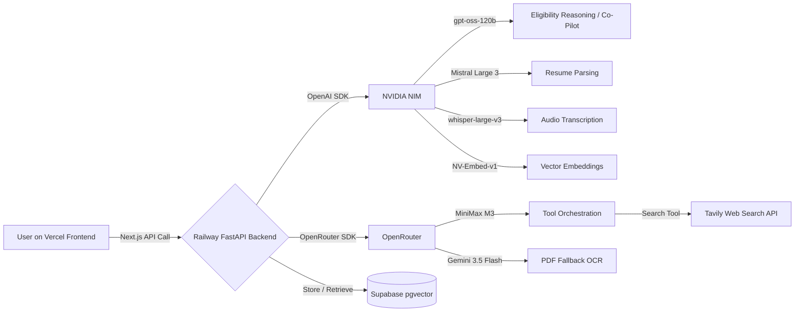

<p align="center">
  
</p>

<h1 align="center">🎯 Opportunity Hunter</h1>

<p align="center">
  <em>"Never miss a life-changing opportunity again."</em>
</p>

<p align="center">
  <a href="#"></a>
  <a href="#"></a>
  <a href="#"></a>
  <a href="#"></a>
  <a href="#"></a>
  <a href="https://github.com/rahulcvwebsitehosting/Opportunity-Hunter"></a>
</p>

---

**Opportunity Hunter** is an autonomous AI career and opportunity strategist. Instead of users searching for opportunities, an AI Agent searches continuously for them—reasoning over a person's entire profile and matching it against complex eligibility criteria. Built with a multi-model AI stack, it parses resumes, hunts the web via Tavily, scores opportunities with explainable reasoning, and drafts tailored applications via an intelligent Co-Pilot.

---

## 🧠 Development Story & AI Stack

> ### ⚡ Built by **GPT-5.6** 🤖 + **Codex (Claude Code)** 🧑‍💻
> These two AI models built this entire project — **every line of code, every architecture decision, every agent in the backend**.

---

### 🔥 The Primary Builders

#### <span style="font-size:1.4em">🤖 **GPT-5.6**</span>
GPT-5.6 wrote **the vast majority of the codebase** — architecting the complete multi-agent workflow, designing the split-deployment architecture (Vercel + Railway + Supabase), and generating the **full backend agent stack**: the Profiler Agent, Hunter Agent, Reasoner Agent, Co-Pilot Agent, the `llm_router.py` that orchestrates all embedded models, and the entire FastAPI application with all its routes (`/onboard`, `/hunt`, `/opportunities`, `/apply`). The frontend UI (Next.js 16 + Tailwind CSS 4 + Shadcn UI + Framer Motion), the AI-Native design system, the accessible component library, and the Supabase schema with pgvector were all generated by GPT-5.6.

#### <span style="font-size:1.4em">🧑‍💻 **Codex (Claude Code)**</span>
Codex (Claude Code) was used for **iterative refinement, debugging, prompt engineering, and orchestrating the AI-to-AI development loop** — where GPT-5.6 and Codex effectively collaborated to build the system. Codex handled real-time debugging sessions, fixed build errors, optimized performance, refactored components, and ensured WCAG AA accessibility compliance across all UI components. Every time a bug was found, Codex traced it, fixed it, and fed improvements back into the development loop.

---

During development, we dynamically switched between other frontier models — including **GLM 5.2**, **DeepSeek V4 Pro**, and **Mistral Large 3** — to generate and refine different modules of the codebase and explore alternative architectural approaches. This hybrid AI development workflow allowed us to leverage each model's unique strengths: GPT-5.6 for structural reasoning and code generation at scale, Codex for agentic coding loops and real-time debugging, and other models for targeted module-level tasks.

We have embedded a multi-model architecture **directly into the website's backend**, with each model serving a specialized agent role:

| Model | Provider | Role |
|-------|----------|------|
| **gpt-oss-120b** | NVIDIA NIM | Heavy eligibility reasoning & tool orchestration |
| **Mistral Large 3** | NVIDIA NIM | Rapid resume parsing & cover letter drafting |
| **MiniMax M3** | OpenRouter | Agentic tool-calling & web search orchestration |
| **Gemini 3.5 Flash** | Free Tier API | Multimodal fallback for parsing scanned PDFs |
| **whisper-large-v3** | NVIDIA NIM | Audio transcription for voice-based profile input |
| **NV-Embed-v1** | NVIDIA NIM | Vector embeddings powering semantic similarity search |

This embedded-model approach means the backend directly calls each model via SDK (OpenAI-compatible for NVIDIA NIM, OpenRouter for the rest), with no external orchestration service required. All models are routed through a unified `llm_router.py` that handles failover, retries, and model-specific formatting.

---

## ✨ Core Features

### 🔍 Resume Parsing (Profiler Agent)
Upload a PDF resume or paste a GitHub link. Mistral Large 3 extracts your true skills, education, experience, and interests into a structured vector profile stored in Supabase pgvector.

### 🎯 Hunter Agent (Tavily API)
The AI reasons over your profile and uses **Tavily API** to hunt the web for scholarships, hackathons, grants, conferences, and internships that match your unique background.

### 📊 Opportunity Score Reasoning
Each opportunity gets a **Match Score (0-100%)** with detailed explainable reasoning — green checkmarks show why you qualify (e.g., "✔ India eligible", "✔ Python experience matches"), and red crosses show mismatches. Includes effort/ROI estimates.

### 🤖 Application Co-Pilot
Stuck on a long application form? The Co-Pilot agent summarizes the requirements, creates a step-by-step checklist, and drafts a tailored cover letter. Features a focus-trapped modal with copy, download, and print support.

### ⏰ Missed Opportunity Detector
A learning system that notices if you ignored high-value opportunities and adapts your feed accordingly, re-surfacing critical matches and deprioritizing irrelevant results.

---

## 🏗️ Architecture

To handle long-running 30-60 second AI agent loops, we used a **split-deployment architecture** to bypass serverless timeout limits:



### Deployment Split

| Layer | Platform | Technology |
|-------|----------|------------|
| **Frontend** | Vercel | Next.js 16 (App Router), Tailwind CSS 4, Shadcn UI |
| **Backend** | Railway | Python FastAPI, multi-model agent stack |
| **Database** | Supabase | PostgreSQL + pgvector extension |
| **AI Inference** | NVIDIA NIM + OpenRouter | Multi-model routing via `llm_router.py` |
| **Web Search** | Tavily API | Real-time opportunity discovery |

---

## 🚀 Local Development Setup

### Prerequisites

- Python 3.11+
- Node.js 20+
- A Supabase project with pgvector enabled
- API keys: NVIDIA NIM, OpenRouter, Tavily, optionally Gemini

### 1. Clone the Repository

```bash
git clone https://github.com/rahulcvwebsitehosting/Opportunity-Hunter.git
cd Opportunity-Hunter
```

### 2. Backend Setup (`/backend`)

```bash
cd backend
python -m venv venv
# Windows: .\venv\Scripts\activate
# macOS/Linux: source venv/bin/activate
pip install -r requirements.txt
```

Create a `.env` file in the `backend/` directory:

```env
# ── NVIDIA NIM ────────────────────────────────────
NVIDIA_NIM_API_KEY=nvapi-your-key-here
NVIDIA_NIM_BASE_URL=https://integrate.api.nvidia.com/v1

# ── OpenRouter ────────────────────────────────────
OPENROUTER_API_KEY=sk-or-v1-your-key-here
OPENROUTER_BASE_URL=https://openrouter.ai/api/v1

# ── Tavily Web Search ─────────────────────────────
TAVILY_API_KEY=tvly-your-key-here

# ── Supabase (pgvector) ───────────────────────────
SUPABASE_URL=https://your-project.supabase.co
SUPABASE_SERVICE_ROLE_KEY=eyJ-your-service-role-key

# ── Profile Enrichment ────────────────────────────
GITHUB_TOKEN=github_pat_your-token-here

# ── Gemini (PDF fallback OCR) ─────────────────────
GEMINI_API_KEY=AIza-your-key-here

# ── Model Aliases ─────────────────────────────────
MODEL_REASONER=openai/gpt-oss-120b
MODEL_PARSER=mistralai/mistral-large-2512
MODEL_ORCHESTRATOR=minimax/minimax-m3

# ── Demo Mode ─────────────────────────────────────
DEMO_MODE=true
```

Seed the demo data and start the backend:

```bash
python seed_demo_data.py     # seeds Rahul Patel + 4 opportunities
uvicorn main:app --reload --port 8000
```

### 3. Frontend Setup (`/frontend`)

```bash
cd ../frontend
npm install
```

Create a `.env.local` file in the `frontend/` directory:

```env
# Backend URL (local or deployed)
NEXT_PUBLIC_API_URL=http://localhost:8000

# Supabase client-side keys (optional, for direct DB access)
NEXT_PUBLIC_SUPABASE_URL=https://your-project.supabase.co
NEXT_PUBLIC_SUPABASE_ANON_KEY=eyJ-your-anon-key
```

Start the frontend:

```bash
npm run dev
```

Open **[http://localhost:3000](http://localhost:3000)**.

---

## 🌐 Environment Variables Reference

### Backend (`backend/.env`)

| Variable | Required | Description |
|----------|----------|-------------|
| `NVIDIA_NIM_API_KEY` | Yes | NVIDIA NIM API key for hosted model inference |
| `NVIDIA_NIM_BASE_URL` | Yes | NVIDIA NIM endpoint (`https://integrate.api.nvidia.com/v1`) |
| `OPENROUTER_API_KEY` | Yes | OpenRouter API key for model routing |
| `OPENROUTER_BASE_URL` | Yes | OpenRouter endpoint (`https://openrouter.ai/api/v1`) |
| `TAVILY_API_KEY` | Yes | Tavily web search API key |
| `SUPABASE_URL` | Yes | Supabase project URL |
| `SUPABASE_SERVICE_ROLE_KEY` | Yes | Supabase service role key (server-side) |
| `GITHUB_TOKEN` | No | GitHub personal access token for profile enrichment |
| `GEMINI_API_KEY` | No | Google Gemini API key (PDF OCR fallback) |
| `MODEL_REASONER` | Yes | Model ID for the Reasoner/Co-Pilot agent |
| `MODEL_PARSER` | Yes | Model ID for the Profiler/Parser agent |
| `MODEL_ORCHESTRATOR` | Yes | Model ID for the Hunter/Orchestrator agent |
| `DEMO_MODE` | No | Set `true` to seed demo data on startup |

### Frontend (`frontend/.env.local`)

| Variable | Required | Description |
|----------|----------|-------------|
| `NEXT_PUBLIC_API_URL` | Yes | Backend URL (e.g., `http://localhost:8000` or deployed Railway URL) |
| `NEXT_PUBLIC_SUPABASE_URL` | No | Supabase URL for client-side queries |
| `NEXT_PUBLIC_SUPABASE_ANON_KEY` | No | Supabase anon key for client-side queries |

---

## 🎬 Demo Flow

```
1. ONBOARD ──► Upload resume (PDF) or paste GitHub link
                   │
                   ▼
2. HUNT    ──► Click "Run Hunter Agent"
                   │  AI reasons over your profile
                   │  Tavily searches the web
                   │  Opportunities scored 0-100%
                   ▼
3. REVIEW  ──► See Match Score with ✔/✘ reasoning
                   │  Effort & ROI estimates
                   │  Collapsible AI rationale
                   ▼
4. APPLY   ──► Click "Apply via Co-Pilot"
                   │  AI summarizes requirements
                   │  Generates step checklist
                   │  Drafts tailored cover letter
                   ▼
         🎉 Ready to submit!
```

---

## 🛠️ Built With

### AI & Models
[GPT-5.6](https://openai.com) · [Codex (Claude Code)](https://anthropic.com/codex) · [GPT-OSS-120b](https://nvidia.com/nim) · [DeepSeek V4 Pro](https://deepseek.com) · [Mistral Large 3](https://mistral.ai) · [GLM 5.2](https://zhipu.ai) · [MiniMax M3](https://minimax.io) · [Gemini 3.5 Flash](https://deepmind.google) · [whisper-large-v3](https://nvidia.com/nim) · [NV-Embed-v1](https://nvidia.com/nim)

### Framework & Infrastructure
[Next.js 16](https://nextjs.org) · [FastAPI](https://fastapi.tiangolo.com) · [Supabase pgvector](https://supabase.com) · [Vercel](https://vercel.com) · [Railway](https://railway.com)

### APIs & Services
[OpenRouter](https://openrouter.ai) · [NVIDIA NIM](https://nvidia.com/nim) · [Tavily API](https://tavily.com)

### Frontend Libraries
[Tailwind CSS 4](https://tailwindcss.com) · [Shadcn UI](https://ui.shadcn.com) · [Framer Motion](https://framer.com/motion) · [Lucide Icons](https://lucide.dev) · [Fira Sans / Fira Code](https://github.com/mozilla/Fira)

---

## 🎨 Design System

The UI follows the **AI-Native UI** style:

- **Palette:** Violet `#7C3AED` + Cyan `#0891B2` on warm white `#FAF5FF`
- **Typography:** Fira Sans (headings/body) + Fira Code (data/code)
- **Accessibility:** WCAG AA — 4.5:1+ contrast, visible focus rings, keyboard navigation, `prefers-reduced-motion` respected, semantic HTML, ARIA labels
- **Effects:** AI typing indicators (3-dot pulse), smooth scroll reveals, count-up score animations, subtle hover lift

---

<p align="center">
  Made with ❤️ by <a href="https://github.com/rahulcvwebsitehosting">@rahulcvwebsitehosting</a>
  <br/>
  <sub><strong>Built by GPT-5.6 🤖 + Codex (Claude Code) 🧑‍💻</strong> · Powered by multi-model AI · For hackathons that change lives</sub>
</p>
